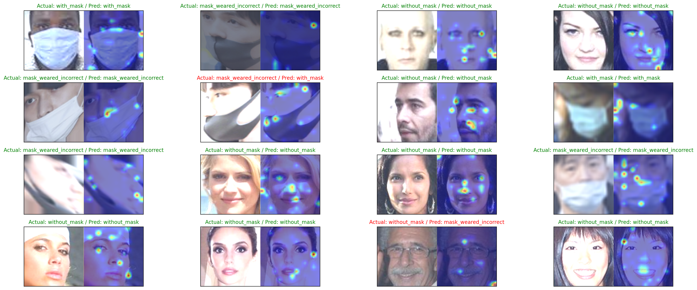

# Vision Transformer From Scratch For Face Mask Detection



Minimal ViT implementation trained on the Kaggle face-mask dataset
`vijaykumar1799/face-mask-detection` with attention map visualization.

## Dataset
- Kaggle hub ID: `vijaykumar1799/face-mask-detection`
- Classes: `mask`, `without_mask`, `mask_weared_incorrect`

## Train
```bash
python train.py
```
This saves a checkpoint to `vit.pt` (weights + config + class mapping).

## vit.pt
The checkpoint includes:
- `model_state`: model weights
- `config`: model hyperparameters
- `class_to_idx`: class mapping from the dataset
- `image_size`: training image size

## Inference
- `infer.ipynb` contains the inference and visualization steps.

## Project Layout
- `ViT.py`: model definition (patch embedding, attention, encoder, classifier)
- `main.py`: data prep + model setup
- `train.py`: training loop + checkpoint saving
